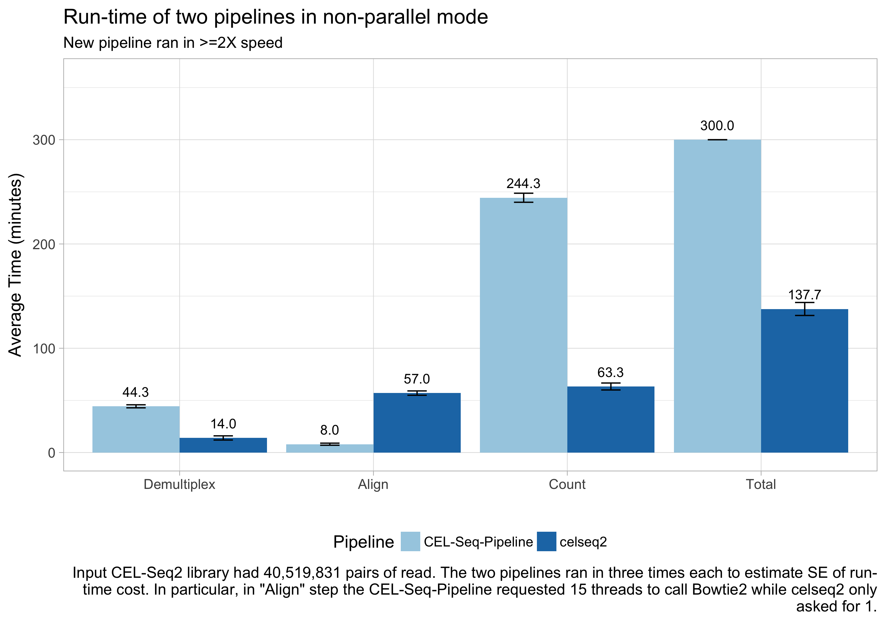
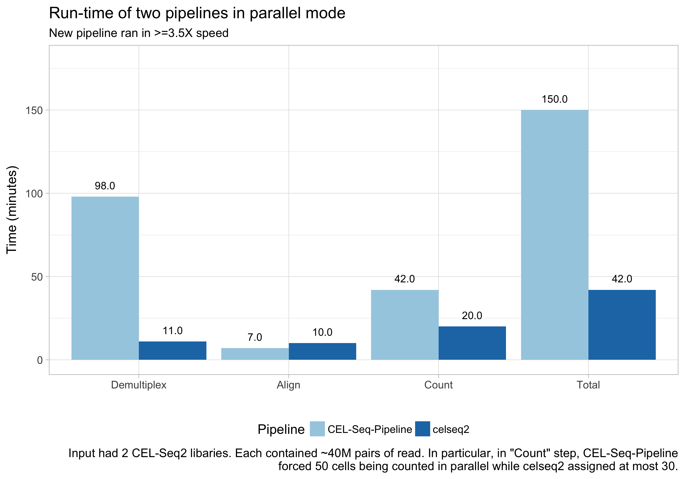

# Performance

We believe data digestion should be automated, and it should be done in a
very, very computational efficient manner :rocket:.

---

## Introduction

As the first generation, `CEL-Seq-pipeline` provided a stable and efficient
service to process CEL-Seq and CEL-Seq2 data. Improving computational
efficiency even on top of that was challenging to ourselves. However, we spared
not effort to challenge the status quo.

Generally speaking, there are two different ways to improve the runtime of a
pipeline:

1. :fa-laptop: Provide more computational resources (e.g., CPU cores or nodes in
a cluster) thus allow more parallelized tasks running in the same time.
2. :fa-gear: Optimize the codes of each pipeline step in order to make it more
   computationally efficient.

`celseq2` features in a new design of work flow with optimized codes written in
Python 3 which leads to boosted computational efficiency, and furthermore brings
flexibility to request computational resources from either local computer or
servers.

## How to compare

Here were two comparisons.

1. In order to demonstrate the efficiency boosted by the optimized codes alone,
`celseq2` and `CEL-Seq-pipeline` ran on the same *one* set of CEL-Seq2 data in
*serial* mode.
2. In order to quantify the difference of performance in real case where
parallelization is often allowed, `celseq2` and `CEL-Seq-pipeline` ran on same
*two* sets of CEL-Seq2 data in *parallel* mode.

The example one set of CEL-Seq2 data consisted of ~40 million read pairs.

## Comparison of runtimes in serial mode

Each run in *serial* mode was performed three times independently to account for
the fluctuation of run-time.

<!--  -->

:white_check_mark: Each step of the work flow was accelerated by `celseq2`,
compared to `CEL-Seq-pipeline`, solely due to the new design with code
optimization.

1. Demultiplexing reached **3-fold** speed.
2. Counting UMIs reached  **4-fold** speed.
3. Overall reached **2-fold** speed.

:bangbang: In this comparison `CEL-Seq-pipeline` had an unfair advantage because
    it internally used 15 threads for parallelizing alignment with `bowtie2` ,
    while the new pipeline stringently used only one thread. Therefore, `celseq2`
    spent more time than `CEL-Seq-pipeline` in this example.

:white_check_mark: Nevertheless, `celseq2` achieved an overall speed of more than
**2-fold** compared to `CEL-Seq-pipeline`.

## Comparison of runtimes in parallel mode

In practice, users usually have multiple CPU or cores available, and
pipelines can take advantage of this fact by splitting up data into smaller
chunks and processing them in parallel, and/or by running individual processes
(e.g., alignment) using multiple threads.

Here the second comparison aimed to quantify the performance of the two pipelines
in a more realistic scenario by running them on a 32-core server in *parallel*
mode [^how-parallel], and testing them on a dataset that consisted of two sets
of CEL-Seq2 data [^dup-data] which totally consisted ~80 million read pairs.

<!--  -->

:white_check_mark: Each step of the work flow was accelerated by `celseq2`,
compared to `CEL-Seq-pipeline`.

1. Demultiplexing reached **9-fold** speed.
2. Counting UMIs reached  **4-fold** speed [^umi].
3. Overall reached **3.5-fold** speed.

:bangbang: In this comparison `CEL-Seq-pipeline` again had an unfair advantage,
    because the computational resources was as twice as what `celseq2` used for
    UMI counting. Internally `CEL-Seq-pipeline` launched a fixed number parallel
    jobs which was 50, instead of 30 [^umi].

:white_check_mark: Nevertheless, `celseq2` achieved a more than **3.5-fold**
    speed compared to `CEL-Seq-pipeline`. In particular, the new design of work
    flow of `celseq2` parallelized the demultiplexing step.

## Summary

1. Compared to `CEL-Seq-pipeline`, `celseq2` achieved the following speed:
    - Demultiplexing: ~4N-fold, where N is the number of sets of CEL-Seq2 data.
    - Alignment: roughly same as expected since no optimization was involved.
    - Counting UMIs: ~4-fold.
2. In real case, the absolute runtime that took`celseq2` to finish ~80 million
read pairs was about 40 minutes [^time-consumed] in this example.

[^how-parallel]: The syntax to run pipelines in parallel mode was
different. `CEL-Seq-pipeline` set `proc=30` in its configuration file. And
`celseq2` requested 30 cores at most simply by setting `-j 30`.

[^dup-data]: For the record, the two sets CEL-Seq2 data were indeed two copies
 of the same one set of data.

[^umi]: It turned out that `proc` parameter of `CEL-Seq-pipeline` was not used
when counting UMIs, but instead internally `CEL-Seq-pipeline` launched a fixed
number parallel jobs which was always 50. See
[line-60](https://github.com/yanailab/CEL-Seq-
pipeline/blob/133912cd4ceb20af0c67627ab883dfce8b9668df/htseq_wrapper.py#L60) and
[line-81](https://github.com/yanailab/CEL-Seq-
pipeline/blob/133912cd4ceb20af0c67627ab883dfce8b9668df/htseq_wrapper.py#L81) in
source code. In this example, they were supposed to request same 30 cores so
`CEL-Seq-pipeline` had roughly twice number of jobs running for counting
UMIs compared to `celseq2`.

[^time-consumed]: The absolute time varies among data sets. For example, it will
take less time if less proportional reads were qualified though same total number
of read pairs (e.g., 40 million).